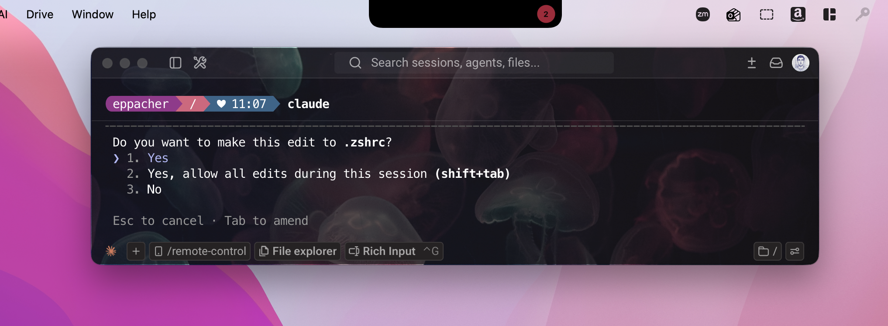
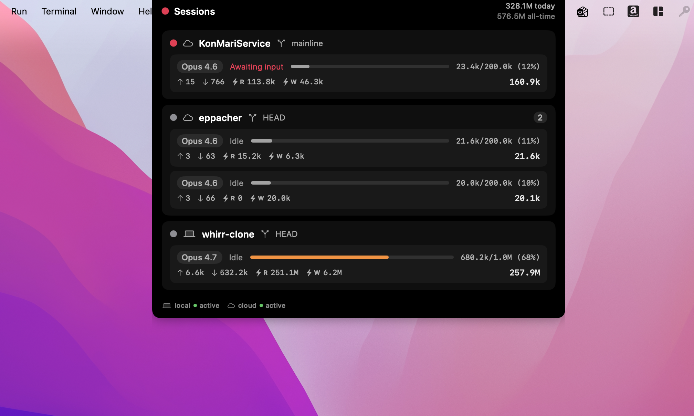

# NotchMonitor

A notch-anchored HUD for macOS that shows live Claude Code session status —
locally and on remote machines you SSH into.





## Install

1. **Download** the latest `NotchMonitor.zip` from the
   [GitHub releases page](https://github.com/aeppacher/NotchMonitor/releases/latest).
2. **Unzip** it (Finder will do this automatically on most browsers).
3. **Move** `NotchMonitor.app` to `/Applications`.
4. **Clear quarantine and launch** — open Terminal and run:
   ```sh
   xattr -dr com.apple.quarantine /Applications/NotchMonitor.app
   open /Applications/NotchMonitor.app
   ```
   Without the `xattr` step, Gatekeeper refuses to launch the unsigned bundle
   and shows *"NotchMonitor can't be opened because it can't be verified."*
   (This is a one-time gate — the in-app auto-updater handles quarantine on
   future updates.) I am not paying Apple $99/yr to sign this.

After first launch, look for a small dashed-rectangle icon in your menu bar.
Click it for the menu:

- **Notch on Main / Laptop / All Displays** — pick where the HUD appears.
- **Monitor SSH Connections** — opt in to polling specific remote hosts (off
  by default; only `local` is monitored until you check something).
- **Start at Login** — auto-launch on next login.
- **Check for Updates…** — manually poll GitHub for a newer release.
- **Quit NotchMonitor**.

If you're enabling SSH monitoring, the remote host(s) need:
- Key-based SSH auth working (no password prompts).
- Claude Code installed and run there at least once.
- `python3` available (used for one-time hook installation).

The first poll on a remote host writes a small set of `~/.claude/settings.json`
hooks (idempotent, only adds entries that point at NotchMonitor's marker
scripts). These are what let the HUD detect "Claude is blocked on a permission
prompt right now."

## What it shows

**Collapsed:** a black pill that wraps around the notch. A small colored dot
on the right wing indicates the most attention-grabbing session state across
all hosts. When more than one session shares that state, the dot grows into
a colored badge with the count.

| Color  | State           | Meaning                                                       |
|--------|-----------------|---------------------------------------------------------------|
| green  | thinking        | Assistant is mid-turn, streaming text/thinking.               |
| blue   | running *tool*  | Tool dispatched, waiting on its result.                       |
| cyan   | processing      | Tool returned, assistant about to react.                      |
| pink   | awaiting input  | Permission prompt is open OR `AskUserQuestion`/`ExitPlanMode`.|
| gray   | idle            | Nothing happening; turn ended; or session went stale.         |

**Expanded** (click or hover for ½s): per-project cards with each session's
model, state, context-window usage bar, and full token breakdown
(input / output / cache-read / cache-write). Header shows token totals for
the last 24 hours and lifetime, summed from `~/.claude/stats-cache.json`
across every monitored host. Footer shows per-host connection state.

## Build and run

### Quick dev loop

```sh
swift run
```

Quit with the menu-bar icon → Quit, or Ctrl-C in the terminal.

### Build a shareable `.app`

```sh
VERSION=0.6.0 ./scripts/build-app.sh
```

This:

1. Compiles the icon (`scripts/make-icon.swift` → `resources/AppIcon.icns`).
2. Builds the release binary (`swift build -c release`).
3. Assembles `dist/NotchMonitor.app` with a generated `Info.plist`.
4. Ad-hoc codesigns it.
5. Zips it to `dist/NotchMonitor.zip`.

`VERSION` defaults to `0.1.0`; override per release. The bundle identifier
(`com.eppacher.notchmonitor`) is constant, so installing a new build over an
old one is a normal in-place update — macOS treats them as the same app.

### Cut a GitHub release

```sh
./scripts/release.sh v0.6.0 "summary of changes"
```

This builds, tags, pushes the tag, and uploads `dist/NotchMonitor.zip` as a
release asset on GitHub via the `gh` CLI. The running app's auto-updater polls
GitHub Releases and offers a one-click "Install & Relaunch" when a newer
version is published.

### Distribute

Send `dist/NotchMonitor.zip`. Recipients:

1. Unzip it.
2. Drag `NotchMonitor.app` to `/Applications` (recommended — cleaner login-item
   path, fewer Gatekeeper friction points).
3. **First launch only:** clear the quarantine flag the browser added on
   download, then open:
   ```sh
   xattr -dr com.apple.quarantine /Applications/NotchMonitor.app
   open /Applications/NotchMonitor.app
   ```
   Without this, Gatekeeper refuses to launch the unsigned bundle and shows
   "NotchMonitor can't be opened because it can't be verified."
4. Subsequent launches: double-click normally.

The auto-updater handles the quarantine flag on its own — every in-app update
runs `xattr -dr com.apple.quarantine` on the swapped bundle, so users only do
the manual step once at install.

### Make/regenerate the icon

The icon is a black squircle with a pink dot in the center, drawn at every
required iconset size and packaged with `iconutil`:

```sh
swiftc -O scripts/make-icon.swift -o /tmp/make-icon
/tmp/make-icon
```

Output: `resources/AppIcon.iconset/*.png` and `resources/AppIcon.icns`.
`build-app.sh` runs this automatically.

To customize: edit colors / proportions in `scripts/make-icon.swift`. Constants
worth knowing:

- `inset = pxSize * 0.10` — Apple-recommended padding around the artwork.
- `cornerRadius = body.width * 0.22` — squircle corner ratio.
- `dotDiameter = body.width * 0.30` — pink dot relative to the squircle.

## Menu-bar item

A status item appears in the menu bar with these entries:

- **NotchMonitor *version*** — disabled header showing the build version.
- **Check for Updates… / Install Update *vX.Y.Z*…** — manual update trigger;
  text changes when a newer release is on GitHub.
- **Notch on Main Display / Laptop Display / All Displays** — radio group
  controlling which screens render a HUD.
- **Monitor SSH Connections** — submenu listing every alias from
  `~/.ssh/config` (and any seen in VSCode Remote storage). Click an alias to
  toggle monitoring; default state is local-only.
- **Start at Login** — toggles a LaunchAgent at
  `~/Library/LaunchAgents/com.eppacher.notchmonitor.plist` that runs
  `open -a /Applications/NotchMonitor.app` at login. Visible in
  *System Settings → General → Login Items → Allow in the Background*
  (not the top "Open at Login" list — that's reserved for SMAppService apps,
  which require Developer ID signing).
- **Quit NotchMonitor** — terminates the app.

## How polling works

`Poller` ticks every 1 second, fanning out across `local` and any user-enabled
SSH hosts concurrently on a global utility queue. Each tick:

1. Runs a small shell script on the host (locally or via SSH).
2. Script lists JSONL files in `~/.claude/projects/` touched in the last
   60 minutes, emitting `===META===` mtime entries for files we've already
   parsed and `===FILE===` blocks (full `cat`) for files newer than our
   cached mtime. Differential streaming keeps SSH bytes low.
3. Script aggregates per-host token totals (24h + all-time) by walking every
   JSONL and summing `usage` blocks, deduped by `message.id` (matching what
   `/usage` reports).
4. Script also installs a one-shot pair of hooks on first run
   (`PermissionRequest`, `PreToolUse`, `PostToolUse`, `PermissionDenied`,
   `Stop`) that touch/remove marker files in `~/.claude/notch/`. The poller
   reads those markers to detect "Claude is currently blocked on a permission
   prompt" — there's no JSONL signal for that, so we use the hook system.
5. Swift parses the new content and recomputes activity per session.

SSH connections are kept warm with `ControlMaster=auto` + `ControlPersist=600`
so successive polls reuse the open socket. Sockets are stored at
`$TMPDIR/notch-monitor-ssh/<hashed-alias>.sock` (filename is hashed so long
host FQDNs don't blow the AF_UNIX 104-byte path limit).

### Host detection

Hosts are auto-discovered by `HostDiscovery`:

1. `local` is always included.
2. VSCode Remote: scans `~/Library/Application Support/Code/.../storage.json`
   and `workspaceStorage/*/workspace.json` for `ssh-remote+<alias>` URIs.
3. `~/.ssh/config`: any non-wildcard `Host` entries.

Remote SSH polling is **opt-in**: discovered aliases appear in the
*Monitor SSH Connections* submenu with checkboxes. Only checked aliases get
polled. State persists in `UserDefaults`.

### Requirements for remote hosts

- Key-based SSH auth (no password prompts — we run with `BatchMode=yes`).
- Claude Code installed and run there (so `~/.claude/projects/` exists).
- POSIX `find`, `stat`, `tail`, plus `python3` for the one-time hook install.

The remote's `~/.claude/settings.json` is auto-patched on first poll to add
the marker hooks. Patches are idempotent — adding our entries doesn't disturb
existing hook configurations.

## Files

| File | Purpose |
|---|---|
| `Sources/NotchMonitor/AppDelegate.swift` | App entry, wires store → poller → notch window → menu bar → updater. |
| `Sources/NotchMonitor/NotchWindow.swift` | Borderless `NSPanel` per display, anchored to the menu-bar row. |
| `Sources/NotchMonitor/NotchRootView.swift` | SwiftUI views: collapsed pill, expanded panel, project cards. |
| `Sources/NotchMonitor/MenuBarController.swift` | `NSStatusItem` with version, update, placement, hosts, login, quit. |
| `Sources/NotchMonitor/SessionStore.swift` | Observable state shared by UI and poller. |
| `Sources/NotchMonitor/JSONLParser.swift` | JSONL → `SessionSnapshot` with cached activity inputs for time-decay. |
| `Sources/NotchMonitor/HostDiscovery.swift` | Local + VSCode Remote + `~/.ssh/config` host enumeration. |
| `Sources/NotchMonitor/SSHBridge.swift` | Subprocess runner with `ControlMaster` reuse. |
| `Sources/NotchMonitor/Poller.swift` | 1s timer, concurrent host fanout, differential streaming, hook install. |
| `Sources/NotchMonitor/Settings.swift` | `UserDefaults`-backed settings + change notifications. |
| `Sources/NotchMonitor/UpdateChecker.swift` | Polls GitHub Releases for new versions. |
| `Sources/NotchMonitor/Updater.swift` | Downloads, swaps bundle via trampoline script, relaunches. |
| `scripts/build-app.sh` | One-shot build + bundle + sign + zip. |
| `scripts/release.sh` | Tag + push + `gh release create` with the built zip. |
| `scripts/make-icon.swift` | Programmatic icon generator (black squircle + pink dot). |

## Known limitations

- Ad-hoc signed; not notarized. Recipients must clear quarantine the first
  time. To notarize, you'd need an Apple Developer account ($99/yr).
- "Start at Login" uses a LaunchAgent plist (works without signing) rather
  than `SMAppService.mainApp` (requires Developer ID *or* `/Applications`
  install). Side effect: it appears under "Allow in the Background" rather
  than the top "Open at Login" list.
- Token totals come from `usage` fields on assistant messages. If Claude
  Code changes its JSONL schema, this may need updating.
